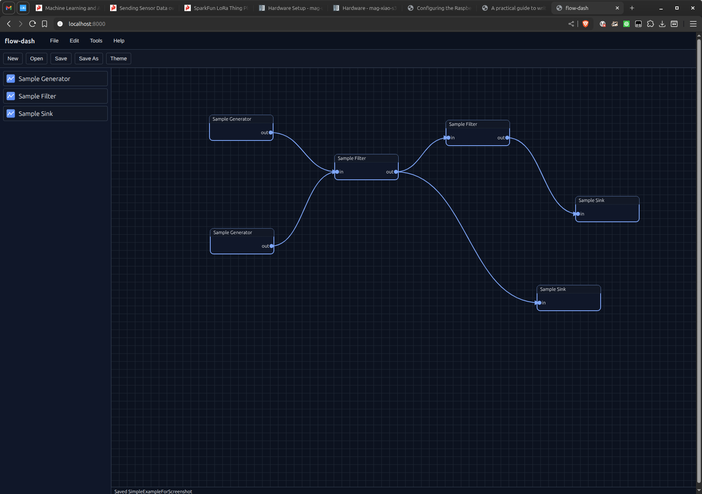

# flow-dash

A minimal, Deno-based flow-graph editor and runtime scaffold inspired by GNU Radio Companion. Drag nodes from a palette onto a canvas, connect them, and save/load projects as JSON.

<p align="center">
  
</p>


## Badges

- Runtime: [Deno](https://deno.com/runtime) 2.x
- CI: [](.github/workflows/deno.yml)


## Features

- Lightweight server using `Deno.serve` to serve static files and JSON APIs
- Framework-free browser UI (plain JS modules) for canvas, palette, toolbar, etc.
- Pluggable storage adapters: filesystem, in-memory, and Deno KV
- Validated project schema with clear errors on invalid payloads
- Simple geometry helpers and tests for SVG edge rendering


## Project Layout

```
.
├── main.ts                     # Deno server entry
├── public/                     # Frontend (no framework)
│   ├── index.html
│   ├── app.js
│   ├── ui/*.js
│   └── assets/
├── obj/                        # Object definition files (<guid>_obj.json)
├── projects/                   # Saved projects (local FS)
├── lib/
│   ├── graph.ts                # Project validation, schema version
│   ├── geometry.ts             # SVG helpers (with tests)
│   └── storage/                # Storage adapters and types
├── docs/                       # Sphinx documentation (source + built HTML)
├── deno.json                   # Tasks, fmt/lint/check config
└── .github/workflows/deno.yml  # CI
```


## Quick Start (Local Dev)

Prerequisites:
- Deno 2.4+ (stable)

Start the dev server:

```sh
deno task dev
```

Open the app:

- http://localhost:8000


## Using the App

- The left panel shows the palette defined by `palette_objects.json`
- Drag items from the palette onto the canvas to create nodes
- Move nodes by dragging their bodies
- Create a connection by clicking a source handle (right) then a sink handle (left)
- Use the toolbar to Save / Save As / Open
- On local dev with filesystem storage, projects are written under `./projects`


## API Overview

All APIs are JSON over HTTP.

- `GET /api/health` → `{ ok: true }`
- `GET /api/palette` → returns `palette_objects.json`
- `GET /api/objects/:guid` → returns object definition from `./obj/<guid>_obj.json`
- `GET /api/projects` → `{ projects: ["<id>_prj.json", ...] }`
- `GET /api/projects/:id` → load a project (accepts `<id>` or `<id>_prj.json`)
- `POST /api/projects/:id` → save a project
- `DELETE /api/projects/:id` → delete a project

Example save:

```http
POST /api/projects/my_first_graph HTTP/1.1
Content-Type: application/json

{
  "version": 1,
  "nodes": [
    { "id": "n1", "guid": "sample-generator", "x": 100, "y": 100 },
    { "id": "n2", "guid": "sample-filter",    "x": 340, "y": 120 },
    { "id": "n3", "guid": "sample-sink",      "x": 580, "y": 140 }
  ],
  "edges": [
    { "from": { "node": "n1", "port": "out" }, "to": { "node": "n2", "port": "in" } },
    { "from": { "node": "n2", "port": "out" }, "to": { "node": "n3", "port": "in" } }
  ]
}
```

Validation errors are returned with HTTP 422 and include details from `lib/graph.ts`.


## Storage Configuration

`flow-dash` supports multiple storage backends behind a common interface (`lib/storage/types.ts`).

Adapters:
- Filesystem (`fs`): saves JSON files under `./projects`
- Memory (`memory`): in-memory map (non-persistent); default for tests and fallback
- Deno KV (`kv`): persistent key-value store (ideal for Deno Deploy)

Select storage by environment variable:

```sh
STORAGE=fs     deno task dev
STORAGE=memory deno task test
STORAGE=kv     deno run --allow-net --allow-env main.ts
```

The server will try the requested adapter first, then gracefully fall back in this order: `kv → fs → memory`.


## Tasks, Lint, and Checks

- Run tests (uses memory storage):

```sh
deno task test
```

- Format and lint:

```sh
deno task fmt

deno task lint
```

- Type-check the server entry:

```sh
deno task check
```


## Deploying to Deno Deploy

Quick test (non-persistent memory storage):
- Create a Deploy project from this repo and set the entrypoint to `main.ts`
- Leave env vars unset → storage will be memory

Enable persistence with Deno KV:
- In your Deploy project, enable a KV database
- Set env var `STORAGE=kv`
- Redeploy; projects will be stored under keys `["projects", <id>]`

See `docs/deploy.rst` for details.


## Documentation

This repo includes Sphinx docs (RST) and a prebuilt HTML copy under `docs/_build/html/`.
- Open `docs/_build/html/index.html` in your browser for an overview, getting started, schema, storage, and deploy guides.


## Schema and Palette

- Project JSON schema and validation logic: `lib/graph.ts`
- Palette: `palette_objects.json`
- Object definitions referenced by the palette: `./obj/*_obj.json`


## Roadmap / Ideas

- More built-in palette objects (sources, transforms, sinks)
- Import/export graphs as SVG/PNG
- Keyboard shortcuts and multi-select operations
- Undo/redo stack
- Authentication for APIs


## Contributing

Issues and PRs are welcome. Please run `deno task fmt` and `deno task lint` before submitting.


## License

This project is licensed under the GNU General Public License v3.0 or later (GPL-3.0-or-later) — see the `LICENSE` file for details.
